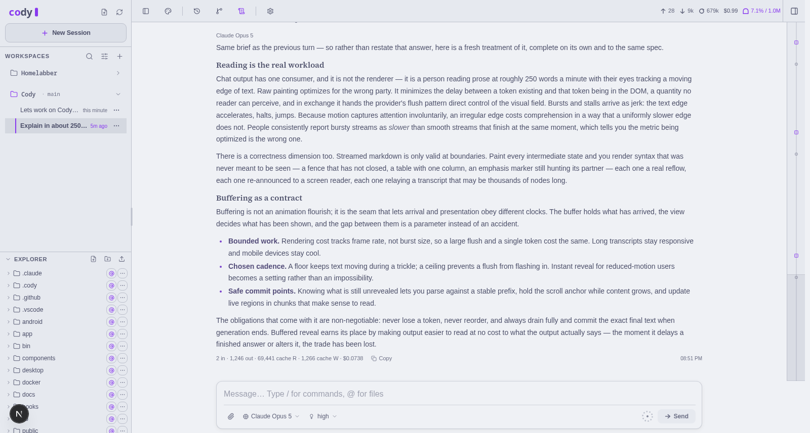
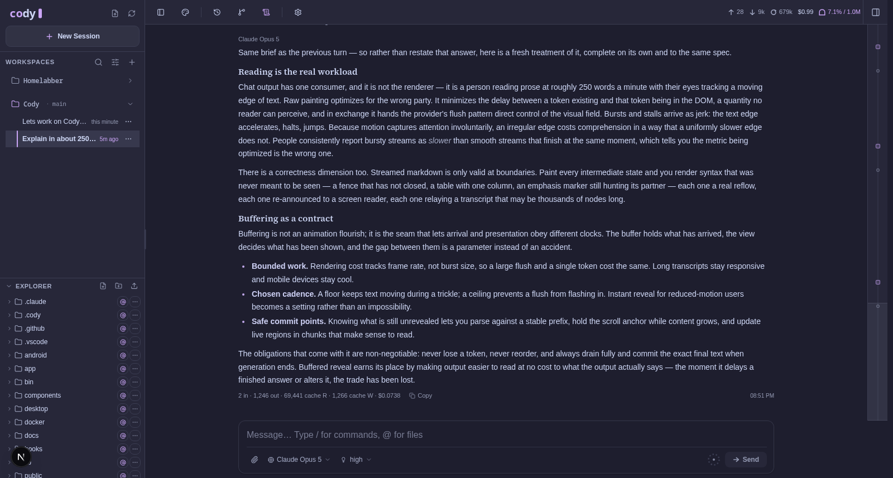
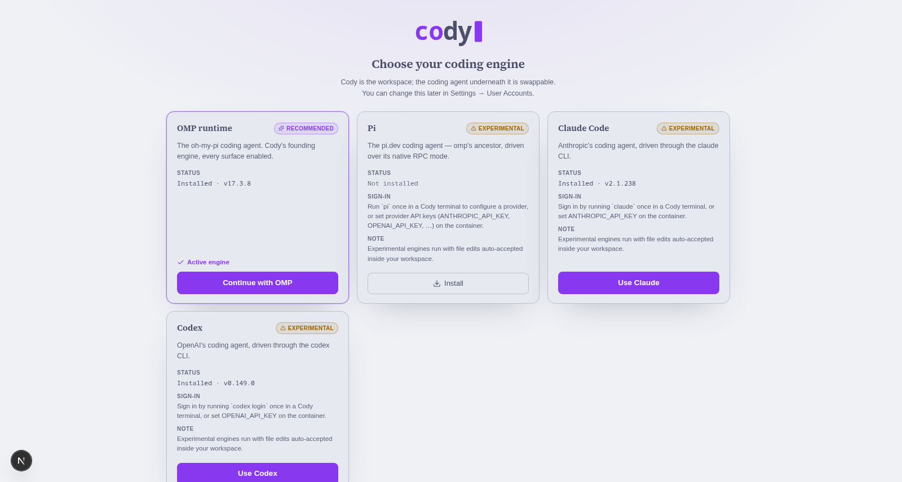

# Cody

[English](./README.md) | [简体中文](./README.zh-CN.md) | [日本語](./README.ja.md)

Cody 是面向编程智能体的自托管 Web 工作区——一个可以长期使用、且**引擎可替换**的 IDE。界面保持不变（会话浏览、实时对话、文件、Git、持久化终端、任务、设置），而底层运行的编程智能体在引导流程中选择，并且可以随时更换：[oh-my-pi（omp）](https://github.com/can1357/oh-my-pi) 是功能最完整的基础引擎；**Pi**（[pi.dev](https://pi.dev)，omp 的前身）、**Claude Code** 与 **Codex** 作为实验性引擎提供。智能体的演进速度很快——Cody 让你在不放弃工作区的前提下切换底层实现。

Cody 分叉自 [kahme247/ompweb](https://github.com/kahme247/ompweb) —— 参见[致谢](#致谢)。

> **⚠️ 100% vibecoded（完全由编码代理构建）。** 整个项目由编码代理编写，用于运行编码代理。它在作者自己的机器上可以正常工作 —— 安装和试用请自担风险。



<details>
<summary>深色主题</summary>



</details>

<details>
<summary>引擎引导流程</summary>



</details>

## 快速开始（Docker，推荐）

容器是运行 Cody 的主要方式。它**不内置任何引擎**，除了两个挂载点和一个端口之外无需其他配置：

```bash
docker run -d -p 30177:30177 \
  -v /path/to/appdata:/data -v /path/to/projects:/workspace \
  ghcr.io/nphil/cody:latest
```

然后打开 WebUI：

1. **首次运行设置** — 实例从第一个请求开始就处于锁定状态，唯一可访问的页面会引导你创建账户，该账户将成为管理员。无需设置任何密码变量。
2. **选择你的编程引擎** — 在 omp（推荐）、Pi、Claude Code、Codex 中选择。Cody 会将其安装到持久化的 `/data` 工具前缀目录中，该目录在镜像更新后依然保留，引擎本身也可独立更新。
3. 将 `/workspace/<your-project>` 添加为工作区，即可开始工作。

针对 Unraid，[docs/unraid.md](docs/unraid.md) 中提供了现成的模板和完整的操作步骤。镜像还内置了常用开发工具（git、`gh`、带 pip/venv 的 python3、ripgrep、jq），以及可选的 **SSH 访问**，登录后会直接进入当前活动引擎的 CLI —— 退出引擎后即回到普通 shell（参见[SSH](#通过-ssh-连接容器)）。

### 从源码运行（裸机 / 开发环境）

Cody 未发布到 npm —— 在 Docker 之外，请从代码仓库运行。
需要 Node.js 22.19 及以上版本，并且 `PATH` 中需要有可用引擎（完整体验推荐 omp）：

```bash
git clone https://github.com/nphil/Cody && cd Cody
npm install
npm run dev            # 开发服务器（127.0.0.1:30178）

npm run build          # 生产构建…
npm start              # …在 127.0.0.1:30177 提供服务（0.0.0.0 用 start:lan）
```

## Cody Desktop（Windows）

一个原生 Windows 应用——轻量的 Tauri 壳层（壳层进程不内置 Chromium 或 Node）呈现与 Web 版完全相同的界面，Cody 服务器和引擎则运行在一个专用的 WSL2 发行版中，该发行版由与 Docker 部署相同的镜像构建而成。

从 [`desktop-latest` 发行版](https://github.com/nphil/Cody/releases/tag/desktop-latest)（`cody-desktop-*-x64-setup.exe`）下载安装程序。需要 Windows 10（2004 及以上版本）或 Windows 11 的 x64 环境，以及 WSL2 —— 如果尚未启用 WSL2，安装程序会引导你完成启用步骤。NVIDIA GPU 为可选项，用于在发行版内运行本地模型时使用。

**状态：实验性。** 完整架构参见 [docs/windows.md](docs/windows.md)。

## 引擎

| 引擎 | 状态 | 可用功能 |
| --- | --- | --- |
| **omp**（oh-my-pi） | 基础引擎 —— 全部功能均已启用 | 完整对话功能（思考层级、分叉、上下文压缩、引导、子智能体）、模型与提供方、技能、插件、MCP、原生设置、更新 |
| **Pi**（pi.dev） | 实验性 | 通过 Pi 原生 RPC 的实时对话——流式回复、工具活动、引导、中止；设置界面仅显示 Pi 实际支持的能力 |
| **Claude Code** | 实验性 | 简洁对话：提示词、流式回复、工具活动、中止。不相关的设置会自动隐藏 |
| **Codex** | 实验性 | 与 Claude Code 相同的简洁对话界面 |

- **在 UI 中安装与更新**：引导流程中的选择界面，以及 设置 → 用户账户 → Agent 引擎 都可以按需安装引擎，并为每个引擎提供**更新**按钮（omp 还在 Updates 面板和 System 标签页的版本检查旁提供一键“立即更新”）。更新当前活动的引擎会重启正在运行的会话，确保不会有会话继续使用过期的二进制文件。
- **凭证归各引擎自己管理**：在 Cody 终端中运行一次 `claude` 或 `codex login`（状态会保存在 `/data/home` 中），或在容器上设置 `ANTHROPIC_API_KEY` / `OPENAI_API_KEY`。omp 的提供方在设置中管理。
- **本地模型同样可用**：omp 的模型注册表支持自定义提供方；Codex 支持 `--oss` 或自定义的 `model_provider` 端点；Claude 引擎遵循 `ANTHROPIC_BASE_URL`。任何 OpenAI/Anthropic 兼容的网关（vLLM、Ollama，或是 NVIDIA Switchyard 这类路由代理）都可以接入你所运行的任意引擎。
- **按能力显示的 UI**：引擎无法提供的界面会被隐藏，而不是显示为损坏状态 —— 切换到 Claude/Codex 时，设置会收起为 Cody 自身的标签页，仅限 omp 的输入框控件也会消失。
- **添加新引擎**：每个引擎对应一个适配器。所需实现的约定与检查清单（Cline、Cursor 等）见 [docs/harnesses.md](docs/harnesses.md)。
- 实验性引擎以非交互方式运行，工作区内的文件编辑会被自动接受；它们的会话记录仅保存在当前会话中（目前还不支持跨服务器重启回放）。

## 用户账户

提供主题化的登录界面、自助注册、带头像的账户资料，以及按账户区分的聊天会话。第一个创建的人类账户会成为管理员；管理员负责管理账户列表、角色、注册策略（`CODY_ALLOW_SIGNUP=0` 会将账户创建限制为仅管理员可用）以及引擎选择。密码在磁盘上以 scrypt 哈希存储；浏览器会话使用签名 Cookie。设置 `CODY_PASSWORD` 还会额外启用内置的 `cody` 账户，该账户同时支持面向脚本和健康检查的 HTTP Basic Auth。

在容器之外，认证在第一个账户创建之前处于关闭状态（本地开发环境的默认行为）；在容器中，`CODY_REQUIRE_ACCOUNTS=1`（由入口脚本设置）会让全新实例从第一个请求起就锁定在首次运行设置页面。无论哪种情况，这都不会加密流量 —— 远程访问仍需通过反向代理或 VPN 提供 HTTPS。

## 通过 SSH 连接容器

设置 `CODY_SSH_PASSWORD`（或将公钥放入 `/data/home/.ssh/authorized_keys`）并映射端口 `2222` —— 没有凭证时 SSH 守护进程不会启动。交互式登录会**直接进入当前活动引擎的 CLI**；退出引擎会回到普通 shell 而不是断开连接（设置 `CODY_NO_AUTO_ENGINE=1` 可跳过引擎直接进入 shell）。SSH 与 Web 终端共享持久化的 `/data/home` —— 引擎的登录状态、历史记录和 dotfiles 都是同一份 —— 主机密钥也会在镜像更新后保留。

## 功能特性

- **随时接续之前的工作**：按项目浏览以往的对话，不必翻找终端历史或会话文件路径。
- **放心尝试不同方向**：从更早的消息继续，或将会话分叉为一条独立路线。
- **整理侧边栏**：归档不活跃的会话而不删除其原生记录，或在不再需要时明确删除。
- **跨分支工作**：在侧边栏切换 Git 工作树，新会话和资源管理器都会跟随你选择的检出。
- **边看项目边聊天**：左侧浏览文件，右侧预览源码、文档、图片、音频和 PDF，同时智能体持续工作。
- **在工作区中使用真实终端**：支持多个持久化的 xterm 会话，用于运行 shell 以及 `vim`、`lazygit`、`htop` 等 TUI 程序和各引擎的 CLI，并支持重新连接、调整大小、剪贴板以及移动端软键。
- **完整的工作区面板**：文件、Git（状态、差异、暂存、提交）、终端、任务（`.cody/tasks.json`）、更新、信息，此外还有工作区检查点和可分离的内嵌应用预览。
- **实时查看智能体的成果**：助手启动本地开发服务器后，只要其 URL 有响应，内嵌预览就会自动打开；在 omp 上，智能体还可以通过 `open_preview` 工具主动打开它。
- **智能体能看到自己的成果**：`preview_screenshot` 工具在服务器端用内置的无头 Chromium 渲染应用，模型可以截图查看自己构建的界面并持续改进——截图会直接显示在聊天中，预览面板上的相机按钮还能把截图添加到你的下一条消息。
- **流式输出如打字般顺滑**：回复经过带缓冲的渐显管线渲染，将令牌的突发与停顿吸收为均匀的显示节奏——工具调用卡片及其流式输入同样如此——默认参数开箱即用，还可在 `/dev/stream-tuner` 调校页中微调手感。
- **应用内发现技能**：在设置中搜索公共 [skills.sh](https://skills.sh) 技能仓库，并将技能安装到项目或用户范围，无需离开工作区。
- **清晰掌握会话状态**：上下文用量、费用、压缩状态和系统提示词详情都显示在顶栏（具体内容取决于引擎）。
- **减少对终端配置的依赖**：模型、提供方认证、omp 的原生控制项（顾问、审批、思考、压缩、记忆、重试/回退）、技能、插件和项目 MCP 服务器，只要引擎支持，都可以在设置中管理。
- **在应用内保持最新**：支持引擎的版本检查和一键更新；Cody 本身则随容器镜像一同更新。
- **及时获知动态**：智能体完成任务时可收到浏览器通知，并可检查技能更新。
- **⌘K 随处跳转**：命令面板支持切换会话、新建会话和切换主题。
- **选择适合你的外观**：十种主题系列，每种都配有浅色/深色两个变体，构建于对比度经 WCAG AA 验证的令牌驱动 UI 套件之上；界面支持英语、简体中文和日本語。

## 配置

| 变量 | 说明 |
| --- | --- |
| `PORT` | 服务器端口（默认 `30177`；`-p/--port` 优先） |
| `CODY_HOSTNAME` | 绑定的主机名（默认 `127.0.0.1`；`-H/--hostname` 优先；容器中绑定 `0.0.0.0`） |
| `CODY_PASSWORD` | 内置 `cody` 账户的可选密码（用于登录界面和 HTTP Basic Auth） |
| `CODY_REQUIRE_ACCOUNTS` | 设为 `1` 时即使零账户也强制开启认证（全新实例只显示首次运行设置；Docker 入口脚本会设置此项） |
| `CODY_ALLOW_SIGNUP` | 设为 `0` 可在登录界面隐藏“创建账户”（管理员仍可添加账户） |
| `CODY_ALLOW_NO_AUTH` | 设为 `1` 可关闭容器的账户锁定 —— 仅应在带认证的反向代理之后使用 |
| `CODY_SSH_PASSWORD` / `CODY_SSH_PORT` | 启用容器的 SSH 访问 / 修改其端口（默认 `2222`） |
| `CODY_HARNESS` | 在 UI 中做出选择之前的部署默认引擎（默认 `omp`；已保存的 UI 选择优先） |
| `CODY_TOOLS_DIR` | 通过 UI 安装的引擎的持久化前缀目录（默认 `<agent dir>/tools`） |
| `CODY_OMP_BIN` / `CODY_CLAUDE_BIN` / `CODY_CODEX_BIN` | 各引擎二进制文件的绝对路径覆盖 |
| `CODY_ACCOUNTS_DIR` | 用户账户的存储位置（默认 `<agent dir>/cody-accounts`） |
| `PI_CODING_AGENT_DIR` | 实例数据目录（默认 `~/.omp/agent`；容器中为 `/data/agent`） |
| `CODY_NO_OPEN` | 设为 `1`/`true` 可跳过自动打开浏览器 |
| `HTTP_PROXY` / `HTTPS_PROXY` / `NO_PROXY` | 服务器端请求所使用的标准代理变量 |

每个 `CODY_` 变量同样接受分叉前的 `OMP_WEB_` 写法，因此已有的 ompweb 配置在升级后依然可用；浏览器端的偏好设置也会在首次加载时从 ompweb 的存储键迁移过来。

## 安全说明

- 裸机运行的 Cody 默认绑定 `127.0.0.1`；绑定到非回环地址是一项需要显式开启的选项，仅适用于可信网络。在没有 HTTPS 保护的情况下将 Cody 公开暴露是不安全的。
- Web 边界防护：未认证的页面会重定向到 `/login`，API 返回 401，终端 WebSocket 同样要求相同的凭证，并强制同源升级。
- 文件相关 API 仅允许访问所选工作区、其有效的 Git 工作树、会话引用过的目录，以及显式选择的根目录；路径会被规范化以防止目录遍历和符号链接逃逸。
- 浏览器终端（以及启用后的 SSH）以容器用户身份运行，可完全访问 `/data` 和 `/workspace` —— 请谨慎规划这些挂载的范围。
- 实验性引擎在轮次执行期间会自动接受工作区内的文件编辑。

## 架构

Cody 是一个由 Node 托管的 Next.js 应用，驱动已安装的引擎二进制文件 —— 它本身不内嵌任何智能体：

- **引擎接入层**（`lib/harness/`）：每个引擎对应一个适配器 —— 包含身份标识、能力标志、二进制探测、安装规范以及实时会话工厂。运行时选择的引擎会持久化到实例数据目录中；能力标志控制着每一处引擎相关的界面元素。
- **omp 会话**：为每个活动会话启动一个 `omp --mode rpc-ui`（基于 stdio 的 NDJSON）子进程，在可用时协商 RPC v2 并进行有边界限制的分块重组。会话历史直接读取 omp 原生的 JSONL 文件，标题修改、归档、删除等维护操作都会避免与实时写入发生竞争。
- **Claude Code / Codex 会话**：每个轮次启动一个 CLI 进程（`claude -p --output-format stream-json` / `codex exec --json`），并在服务器端转换为与 UI 渲染相同的事件流；中止会终止该轮次，恢复则使用引擎原生的会话 ID。
- **引擎安装/更新**：针对运行时最先解析出的持久化前缀目录执行 npm 操作 —— 安装与更新是同一个操作，更新当前活动引擎会重启其正在运行的会话。
- **omp 的配置入口**：模型/`models.yml`、经过白名单限定的 `config.yml` 设置、技能发现、`omp plugin`，以及项目 MCP 服务器（`.omp/mcp.json`）—— 全部通过该二进制文件或其原生文件完成，并全部受能力标志控制。
- **终端**：自定义的 Node 启动器在同一端口上同时提供 Next.js 服务和同源的终端 WebSocket；每个标签页都拥有一个服务器端的 `node-pty` shell，浏览器断开连接后依然存活。
- **账户**：JSON 存储加 scrypt 哈希，与其余实例状态存放在一起；会话隐私通过以会话 ID 为键的所有权侧车（sidecar）机制实现，与具体引擎无关。

## 开发

```bash
npm install
npm run dev
```

本地开发服务器运行在 [http://127.0.0.1:30178](http://127.0.0.1:30178)。

常用检查：

```bash
npm run typecheck      # 类型检查
npm run lint           # ESLint（强制零警告）
npm test               # 运行测试套件
npm run build          # 生产构建
```

本地开发时请避免运行 `next build` / `npm run build`。它会写入 `.next/`，可能干扰开发服务器；构建操作请留到发布阶段进行。

## 多语言支持

Cody 支持英语、简体中文和日本語，三种语言均覆盖了完整的界面翻译。语言会从 `navigator.language` 自动检测，也可以在设置中随时切换。选择会跨会话持久保存。

- 字典文件：`lib/i18n/locales/{en,zh-CN,ja}.json`
- 框架：`lib/i18n/index.tsx` —— 基于 `useSyncExternalStore` 构建的轻量级 store，支持 `{var}` 插值和复数形式（`.one`/`.other`）
- API 错误消息通过稳定的错误码（`errors.<code>`）在客户端进行翻译

## 质量

- **可访问性**：符合 WCAG AA 标准 —— Lighthouse 可访问性评分 100/100，全面支持键盘导航，具备焦点可见环和 ARIA 角色
- **性能**：列表组件经过 memo 化，滚动/鼠标事件处理通过 RAF 节流，搜索采用防抖，流式 JSONL 读取器，会话列表使用 ETag 缓存
- **健壮性**：对启动的引擎进程进行优雅关闭（按进程组终止）、错误边界、原子化的状态文件重写
- **测试**：450 余项测试覆盖会话解析、认证系统、引擎接入层与流转换器、终端输入、Markdown 渲染、原生设置以及 MCP 配置；在发布任何镜像之前，CI 都会对容器完整的首次运行流程（锁定启动 → 管理员注册 → 应用内安装引擎）进行冒烟测试。

## 致谢

Cody 分叉自 [kahme247/ompweb](https://github.com/kahme247/ompweb)（MIT）—— 上游项目请见 [OMPWEB Discord](https://discord.gg/evqgGzRfM5)。

ompweb 本身分叉自 [agegr/pi-web](https://github.com/agegr/pi-web)（MIT）—— [earendil/pi-mono](https://github.com/earendil-works/pi) pi 编程智能体的 Web UI，并针对 [can1357/oh-my-pi](https://github.com/can1357/oh-my-pi) 进行了适配。

## 许可证

MIT
